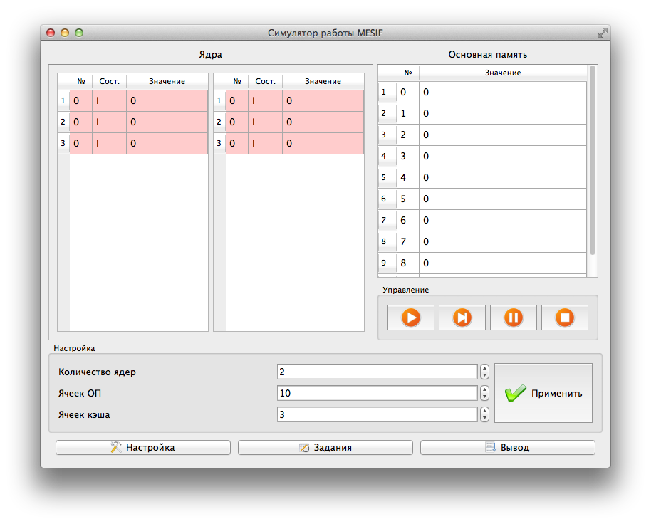

# MESIF emulator

The program is designed to emulate the behavior of [MESIF coherence caches](https://en.wikipedia.org/wiki/MESIF_protocol) and can run multiple threads. It can simulate up to 32 processor cores, 256 main memory cells, and 256 cache cells.

Can be built for Windows/Mac/Linux/Android

